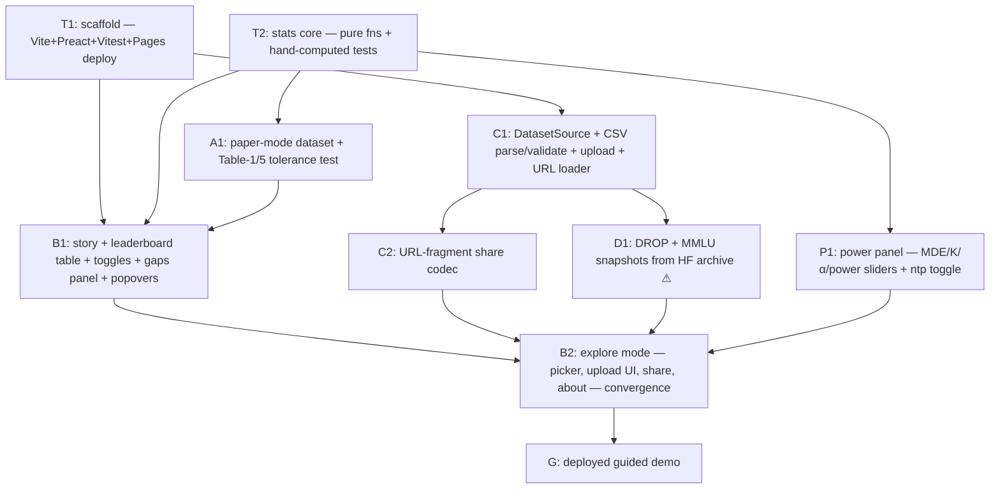

# MIKADO — Fluke: "Error Bars for Evals" Interactive Demo

Canonical Mikado graph for this effort. Planning rules: `AGENTS-mikado-planning.md`. Execution rules: `AGENTS-mikado-execution.md`.

## Goal (G)

A deployed, zero-install browser experience that turns **"Adding Error Bars to Evals"** (Miller 2024, [arXiv:2411.00640](https://arxiv.org/abs/2411.00640)) into an interactive tool: a reviewer lands on a URL and within 30 seconds watches a leaderboard claim ("Dreadnought wins 2 of 3 benchmarks") flip under proper statistics — then explores datasets, uploads CSVs, and shares links. Prior art (`evalci`, `evalstats`, Inspect AI metrics) cited in-app; our value-add is the missing zero-install visual front-end.

Assignment context: take-home, themes *Exploration & Understanding* + *Evaluation & Data Quality*, **2h implementation cap** (covers D-slices 1–2; planning + mockup excluded).

## Design decisions (settled — no TBDs)

| Decision | Choice | Notes / tradeoff |
|---|---|---|
| Backend | **None — fully static** | Knowing deviation from the brief's "simple API" line, chosen for 2h realism. All data loading behind a `DatasetSource` interface so a real API can slot in later. |
| Sharing | **URL-fragment encoding** (lz-string) | View state (+ compressed uploaded dataset) in `#` fragment; bundled datasets share by id + view state. Size guard with friendly error. |
| Stack | TypeScript, Preact + Vite, Vitest, custom SVG charts | No LLM calls, no keys, no runtime network calls after page load. |
| Table 5 reproduction | **Tolerance-based** (±0.15pp), seeded RNG correlated Bernoulli calibrated to Table 5 params | Table 5 is fictional models (Galleon vs Dreadnought): MATH +2.5% SE 0.7% ρ=0.50; HumanEval −3.1% SE 2.1% ρ=0.64; MGSM −2.7% SE 1.7% ρ=0.37. Exact deterministic construction = follow-up; swappable for real data via `DatasetSource`. |
| CSV schema | Required `model, item_id, score` (score ∈ [0,1] continuous); optional `cluster_id`, `sample_k` (repeats — parsed and averaged per item), `benchmark` (absent → single implicit benchmark) | Matches approved mockup dropzone hint. ω²/σ² decomposition from sample_k = stretch; averaging keeps SEs correct. Strict format v1 + downloadable template; sniffing = follow-up. |
| CSV validation | Pairing needs item_id overlap → validate, fall back to unpaired with visible notice. Reject duplicate (model, benchmark, item_id, sample). cluster_id consistent per item. Single-model uploads OK (error bars only). | Friendly, specific errors are part of C1 acceptance. |
| CSV by URL | Paste a CSV link (HuggingFace / raw GitHub) → fetch client-side, same parser; explain CORS failures in plain language | Per mockup URL row. |
| Real datasets | **DROP** (per-question logs, 588 passage clusters) and **MMLU** (57 subject clusters) from the HF Open LLM Leaderboard archive (`open-llm-leaderboard-old/results` + details datasets) → CSV snapshots in-repo (⚠ risk) | Timebox ~30 min; fallback: honestly-labeled synthetic with realistic clusters. Scores + group labels only, no benchmark questions/answers. |
| Tour genre | 4-step story box above a persistent leaderboard table; toggles always visible; "gaps up close" collapsible; explore mode after tour | **Approved via user-edited mockup (`mockup/index.html`) — build directly to it.** |
| Paper numbers | Table 1/5 values with the mockup's documented correction: HumanEval Dreadnought 86.7 (the 87.7 in Table 1 contradicts the paper's own −3.1 diff) | Correction noted in the About panel. |
| Rec #3 answer luck | Folded into the power panel (K slider = "times each question is asked") + "grade by answer probabilities" toggle + popovers with the temperature-0 warning | Replaces the earlier separate K-slider widget. |
| Rec #5 power | **In scope (promoted from stretch)**: interactive power panel — MDE / K / α / power sliders + next-token-prob toggle → questions-needed readout; uses dataset-estimated variances when a dataset is loaded, paper's illustrative values otherwise | Replaces the MDE badge node. |
| Validation | Hand-computed unit tests + Table 5 tolerance test inside cap; Python cross-check vs `evalci`/`statsmodels` = first post-cap follow-up | |
| Hosting | GitHub Pages via Actions (Vite `base` path) | Repo doubles as code deliverable. |
| Rationale doc & video | User writes both | README cites prior art + tradeoffs to feed it. |

## UX principles (govern every UI node)

1. **General audience by default — zero jargon on the surface.** Plain language + the paper's analogies ("a benchmark score is a poll, not a fact"; clustering = "1,000 people from 200 households"; "answer luck"). No Greek letters / "standard error" / "ρ" in default-visible text — say "margin of error," "could easily flip," "can't reliably see gaps under X points."
2. **Progressive disclosure.** Every simplified claim has a collapsed drill-in (footnote/popover) with the precise term, the paper's formula + section reference, and caveats. Three tiers: plain narrative → formula popover → power-user section (stretch).
3. **One idea per step.** Each tour step applies one correction to the same live chart and states its plain-language consequence.
4. **Never a dead end for experts.** Popovers cite paper sections and prior-art libraries.

## Architecture (target)

```
src/
  stats/       # T2 trunk: pure functions, zero deps, fully unit-tested
  data/        # C branch: types.ts (DatasetSource), bundled.ts, papermode.ts (A1), csv.ts, share.ts
  ui/          # B branch: Story.tsx, Leaderboard.tsx, Toggles.tsx, GapsPanel.tsx, Popover.tsx, Toolbelt.tsx, PowerPanel.tsx (P), About.tsx
public/datasets/*.csv    # snapshotted real data (D branch; under public/ so the static site serves them — moved in B2)
scripts/fetch_hf_data.*  # one-time wrangling, committed for provenance
mockup/index.html        # approved clickable mockup (planning artifact)
.github/workflows/pages.yml
```

Runtime flow: URL fragment → `share.decode` → `DatasetSource.load` → `stats/*` (pure) → chart props → UI. Upload: file → `csv.parse` → same pipeline.

## Dependency graph



## Node table

One row per node; node PRs edit **only their own row** (flip status to `done` + PR link).

| ID | Description | Files | Done when | Test plan | Risk | Est. | Status |
|---|---|---|---|---|---|---|---|
| S0 | Mockup + repo init | `mockup/`, `MIKADO.md` | Mockup approved by user; repo pushed | n/a (planning artifact) | low | — | done (direct to main, pre-PR) |
| T1 | Scaffold + CI deploy to Pages | root config, workflow | Hello-world live on Pages URL | build passes in CI | low | S | done — PR #1 |
| T2 | Stats core (mean, SE, clustered SE, unpaired/paired gap SE, correlation, power/MDE with K and ntp) | `src/stats/*` | All hand-computed cases pass | Vitest incl. paper worked examples (n≈969 power; K=2 → ⅓ variance cut) | low | M | done — PR #2 |
| A1 | Paper-mode dataset (deterministic MATH/HumanEval, seeded MGSM) | `src/data/papermode.ts`, `src/data/types.ts` | Means/gaps/paired SEs match Tables 1&5 (±0.15pp deterministic, ±0.3pp seeded); correlations ±0.08 (paper's fictional values not jointly achievable — documented); headline flip asserted | Vitest tolerance suite | med | M | done — PR #3 |
| B1 | Story box + leaderboard table + toggles + claim + gaps panel + popovers (per mockup) | `src/ui/*` | 4-step flip narrative end-to-end; jargon-free defaults; every dashed value pops a formula + citation | Component smoke tests + manual click-through | med | L | done — PR #5 |
| B2 | Explore mode: dataset picker, dropzone + URL loader UI, share button, About panel; wires C2/D1/P1 | `src/ui/*`, `src/data/bundled.ts`, `public/datasets/` | All datasets browsable; upload + URL load work; share works in fresh tab | manual + smoke + D1↔C1 conformance tests | low | M | done — PR #9 |
| C1 | Data layer: types, CSV parse/validate (item_id, cluster_id, sample_k averaging, benchmark), template download, URL fetch with CORS-friendly errors | `src/data/*` | Valid CSV renders; invalid CSV → specific friendly errors; URL fetch failure explains fix | Vitest parser + validation edge cases | low | M | done — PR #6 |
| C2 | Share codec (#ds/toggles/step + compressed upload) | `src/data/share.ts` | Link round-trips full view state (+ uploaded data) in fresh tab | Vitest round-trip + manual | low | S | done — PR #7 |
| D1 | DROP + MMLU per-question snapshots from HF archive | `datasets/`, `scripts/` | CSVs in repo with cluster labels + real model names; load in app | validated by C1 parser | **high** | M | done — [#8](https://github.com/jv8-alt/fluke/pull/8) (real data landed, no fallback; Llama-2-70b-hf vs falcon-40b) |
| P1 | Power panel: MDE/K/α/power sliders + ntp toggle → questions-needed; dataset-estimated variances when available | `src/ui/PowerPanel.tsx` | Readout matches power fn; paper example (3pt, 80%, α=.05 → ≈969) reproduced with ntp on | Vitest on power fn, manual on UI | low | S | done — PR #4 |
| X1 | Post-launch tweaks: tour-completion cookie, toggle change highlighting, gaps-panel combination hint | `src/ui/*` | Return visit after full tour lands in explore mode; changed values flash on toggle; gaps hint names all active corrections | Vitest on hint fn + manual | low | S | done — PR #10 |
| X2 | Trim gaps-panel body text (hint carries the combining message) | `src/ui/App.tsx` | Sentence removed | copy-only (§4 exception) | low | S | done — PR #11 |
| X3 | Real MMLU pair with verdict flips: vicuna-13b-v1.5 vs Llama-2-13b-hf, gap ≈2.1pp | `scripts/`, `public/datasets/mmlu-close.csv`, `src/data/bundled.*`, `src/ui/About.tsx` | Toggling uN→uC→pC on the bundled pair flips real→too close→real, asserted with ≥0.1pp boundary comfort | Vitest conformance + flip suite + manual | low | M | done — PR #12 |
| X4 | README + docs/design.md (design rationale per assignment) | `README.md`, `docs/design.md` | README covers overview/live URL/dev setup and links design.md; design.md covers theme choice, non-obvious ideas, tradeoffs, extensions, time spent | author-facing docs (§4 exception) | low | S | done — PR #13 |
| X5 | ~~Split margin bars~~ — **reverted** (PR #15): annotating the score margins added noise and confused more than it explained | — | — | — | — | — | reverted; superseded by X6 |
| X6 | Per-model ± out of the leaderboard: bare scores + gap ± beside the verdict; per-model margins move to the gaps panel as "each score on its own" | `src/ui/App.tsx`, `src/ui/app.css` | Leaderboard shows no per-model ±; verdict cell shows gap ±; gaps panel shows both, drill-ins intact; tour steps 2–4 still land | manual browser check of all 4 tour steps + both real datasets (§4: presentation-only; underlying values already unit-tested) | low | S | done — PR #16 |
| X7 | Switching data source resets all corrections off, so every dataset starts at the naive scoreboard | `src/ui/App.tsx` | Picking any dataset (or uploading) leaves all three boxes unchecked; shared links still restore their own state | manual browser check across all four datasets + a shared link (§4: presentation-only) | low | S | done — PR #17 |
| X8 | Sharpen the prior-art claim: navigable experience for learn/check/plan, not merely zero-install | `src/ui/About.tsx`, `README.md`, `docs/design.md` | All three places name the three jobs the interface serves rather than only "no install" | copy-only (§4 exception) | low | S | done — PR #18 |
| X9 | Tour auto-plays only the first-ever visit; every later visit (finished, skipped, or abandoned) opens in explore mode; Restart tour / Guided demo always available | `src/ui/App.tsx` | Second page load never auto-starts the story, regardless of whether the first visit finished it; manual restart still works | manual browser check: first visit, abandoned-mid-tour visit, restart (§4: presentation-only) | low | S | done — PR #19 |
| Y1 | Document the input-flexibility roadmap (synonyms → wide → multi-file merge) + the CORS-vs-schema finding | `docs/design.md` | Design doc records why the schema, not the plumbing, blocks people, and names multi-file merge as the endpoint | docs-only (§4 exception) | low | S | done — PR #20 |
| Y2 | URL loader: don't report success for a file that fetched but failed validation; placeholder names the format constraint | `src/ui/Toolbelt.tsx` | Failed parse shows the error without "Loaded from link"; successful load unchanged | manual browser check of both paths (§4: presentation-only) | low | S | done — PR #21 |
| Y3 | Demo CSV working via raw link or download-and-upload, + seeded generator | `public/datasets/example-eval.csv`, `scripts/make_example_csv.py`, `src/data/example.test.ts` | Parses warning-free by both routes; reading's larger lead dies under clustering while arithmetic's smaller one survives, with ≥1pp boundary headroom | Vitest conformance + manual check of both import paths against the live raw URL | low | M | done — PR #22 |
| Y4 | Page load with no URL arguments opens on the naive scoreboard: no checkboxes checked, every collapsible section closed | `src/ui/App.tsx` | Returning and first visits both load all-unchecked with only the leaderboard showing; shared links still restore their own state | manual browser check of first visit, returning visit and a shared link (§4: presentation-only) | low | S | done — PR #23 |
| Y5 | One-click "try our example file" tip in the URL box, pinned to the `main` raw URL | `src/ui/Toolbelt.tsx`, `src/data/csv.ts`, `src/ui/app.css` | Tip fills the box with the example URL and loads it; URL asserted to target main and the real file path | Vitest guard on the URL + manual browser check against the live link | low | S | done — PR #24 |

## Deliverable slices

- **D-slice 1 — never-cut core** (T1, T2, A1, B1 + deploy): paper-mode story + leaderboard with toggles, tested, live URL. Ship and validate before continuing.
- **D-slice 2 — datasets, sharing & power** (C1, C2, D1, P1, B2): upload + URL load, real DROP/MMLU data, share links, power panel, About.
- **D-slice 3 — post-cap follow-ups** (documented, not built): Python golden fixtures vs `evalci`/`statsmodels`; ω²/σ² decomposition from `sample_k`; CSV sniffing; exact (non-tolerance) paper-number construction; production hardening list.

## Branch boundaries & convergence

- Trunks: T1, T2 (merge before parallel work). Branches: A (`src/data/papermode.ts`), B (`src/ui/`), C (`src/data/` except papermode), D (`datasets/`, `scripts/`), P (`src/ui/PowerPanel.tsx`).
- Sole convergence: **B2** (fed by B, C, D, P). Collapse plan: the B-branch agent survives and takes B2 → G.
- Given total size, sequential single-agent execution is acceptable; parallelism optional after trunks merge.

## Verification (G-level)

1. `npm test` — stats hand-computed cases, Table 5 tolerance, CSV parser, share round-trip.
2. `npm run build` + preview: full tour click-through; toggle each correction; switch datasets; upload sample CSV; share link round-trip in fresh tab.
3. CI deploy green; public Pages URL delivers the 30-second zero-input journey cold.
