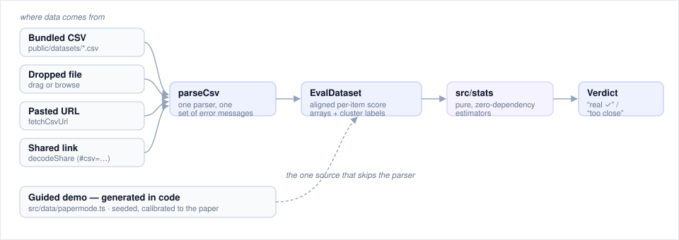
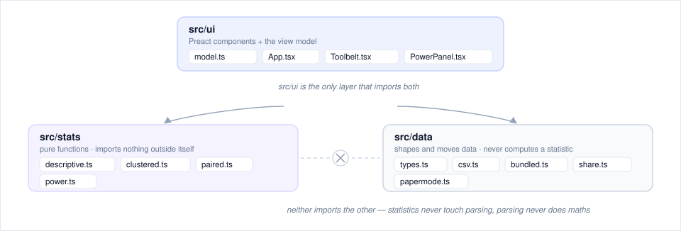
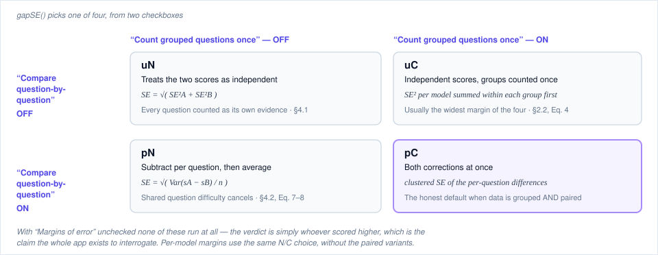

# Architecture

How Fluke is put together, for anyone reading or extending the code.
Companion to the [design rationale](design.md), which covers *why* rather
than *how*. Live app: [jv8-alt.github.io/fluke](https://jv8-alt.github.io/fluke/).

## The shape of it

A static single-page app. No backend, no API keys, no server-side anything:
the page is built to a folder of files and served by GitHub Pages. Every
statistic is computed in the browser, and uploaded data never leaves it —
even a shared link keeps its payload in the URL *fragment*, which browsers
never send to a server.

That constraint is doing real work. It means the demo is also the tool: the
same code path that renders the guided story renders your own eval, because
there is no privileged server-side path for it to differ from.

## How data becomes a verdict

Everything the app can show comes from one pipeline. A file you drop, a link
you paste, a bundled snapshot, and a dataset embedded in a shared link all
converge on the same parser and the same estimators — so they cannot disagree
about what counts as an error, or what counts as a real lead.

The guided demo is the one exception, and deliberately so: it is *generated*
rather than parsed, because the paper publishes only summary statistics and
the per-question data behind its worked example does not exist. `papermode.ts`
synthesizes per-question outcomes calibrated to reproduce the published
numbers, and joins the pipeline at exactly the point a parsed file would.

The shared shape is `EvalDataset` (`src/data/types.ts`): per benchmark, an
array of item ids, an optional parallel array of cluster labels, and one
score array per model — all aligned by index, which is what lets the paired
estimators subtract element-wise without matching keys at compute time.

## Layers, and one rule

The rule worth knowing: **`src/stats` and `src/data` do not import each
other.** Statistics never touch parsing; parsing never does arithmetic on a
score. They meet in exactly one place, `src/ui/model.ts`, which turns an
`EvalDataset` into the numbers a component renders.

This keeps `src/stats` free of any notion of files, uploads, or benchmarks —
it takes arrays of numbers and returns numbers, which is why its tests can be
hand-computed arithmetic with the expected values derived in comments. It
also means the parser can be rewritten, or a real API dropped in behind
`loadBundled`, without a single estimator changing.

## Which estimator runs when

The two correction checkboxes select between four gap standard errors. This
is the heart of the app, and the one piece of indirection worth reading
carefully — `gapSE()` in `src/ui/model.ts` is a two-character lookup that
hides a real decision.

All four are precomputed once per benchmark in `computeBenchmarkStats`, so
toggling a checkbox is a lookup rather than a recomputation — which is why
the UI can re-derive every verdict and claim line on each keystroke without
noticeable work.

## Module reference

| Path | Responsibility |
|---|---|
| `src/stats/descriptive.ts` | mean, sample variance, standard error, 95% intervals |
| `src/stats/clustered.ts` | cluster-aware standard error (grouped-sum form) |
| `src/stats/paired.ts` | paired and unpaired gap SEs, correlation |
| `src/stats/power.ts` | questions-needed, minimum detectable effect, the ω²/σ² model |
| `src/data/types.ts` | `EvalDataset` / `BenchmarkData` — the one shared shape |
| `src/data/csv.ts` | parse + validate uploads, template, URL fetch with friendly errors |
| `src/data/bundled.ts` | the dataset picker registry and its loader |
| `src/data/papermode.ts` | the generated guided-demo dataset |
| `src/data/share.ts` | URL-fragment codec, compression, size guard |
| `src/ui/model.ts` | `EvalDataset` → displayed numbers, verdicts, claim line |
| `src/ui/App.tsx` | app shell: tour, leaderboard, gaps panel, state |
| `src/ui/Toolbelt.tsx` | dataset picker, dropzone, URL loader |
| `src/ui/PowerPanel.tsx` | "how big must an eval be?" |
| `src/ui/popover.tsx` | drill-in content: plain language, formula, paper citation |
| `scripts/` | one-off data wrangling, committed for provenance |

## Build and deploy

`npm run build` type-checks (`tsc --noEmit`) and then bundles with Vite to
`dist/`. Every push to `main` runs the full test suite and the build, and
publishes `dist/` to GitHub Pages; a failing test fails the deploy. Vite's
`base` is set to `/fluke/` to match the Pages path, which is why local dev is
served from `http://localhost:5173/fluke/` rather than the root.

Runtime dependencies are `preact` and `lz-string`. Everything else — the
charts, the CSV parser, the statistics — is first-party, which is what keeps
the bundle around 20 KB gzipped.

## Testing strategy

Tests are colocated (`*.test.ts` beside the module) and run with Vitest.
Three kinds, deliberately:

- **Hand-computed** — `src/stats` cases carry their expected values derived
  by arithmetic in comments, plus the paper's own worked examples (≈969
  questions for a 3-point gap; K=2 cutting variance by exactly ⅓).
- **Tolerance** — the generated paper-mode dataset must reproduce the paper's
  published statistics within stated bounds.
- **Conformance** — the bundled real snapshots must round-trip through the
  *upload* parser and reproduce the source archive's own aggregate numbers
  through our estimators. This is what stops the data layer and the stats
  layer from drifting apart despite never importing each other.

Presentation-only changes are verified in a browser rather than asserted;
where that happens it is stated in the pull request rather than left implied.

## Where to extend it

- **A new dataset**: add a CSV under `public/datasets/` and an entry in
  `BUNDLED` (`src/data/bundled.ts`). No other file needs to know.
- **A new estimator**: add it to `src/stats` with hand-computed tests, then
  surface it in `computeBenchmarkStats`. It cannot need anything from
  `src/data`, and if it seems to, the dataset shape is probably the thing to
  change.
- **A real backend**: `loadBundled` is the seam. Everything downstream takes
  an `EvalDataset` and does not care where it came from.
- **Accepting other file formats**: `parseCsv` is the single entry point for
  every source, so an adapter that produces an `EvalDataset` slots in beside
  it. See the input-flexibility roadmap in [design.md](design.md#where-to-go-from-here).
