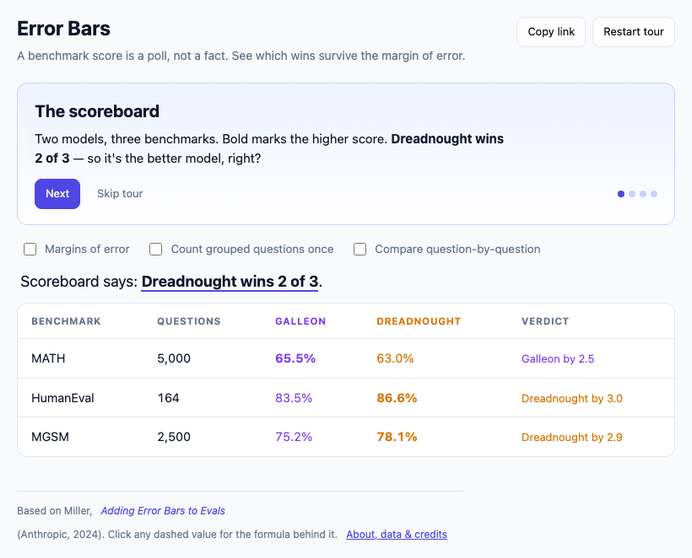
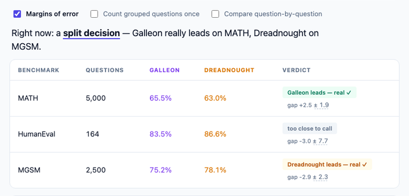
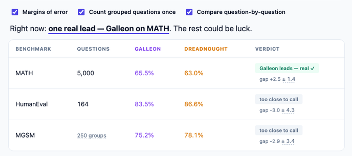
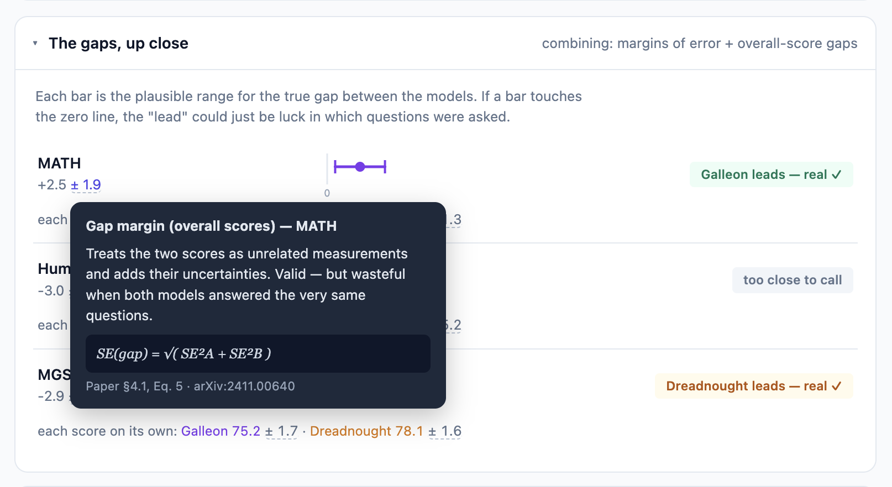
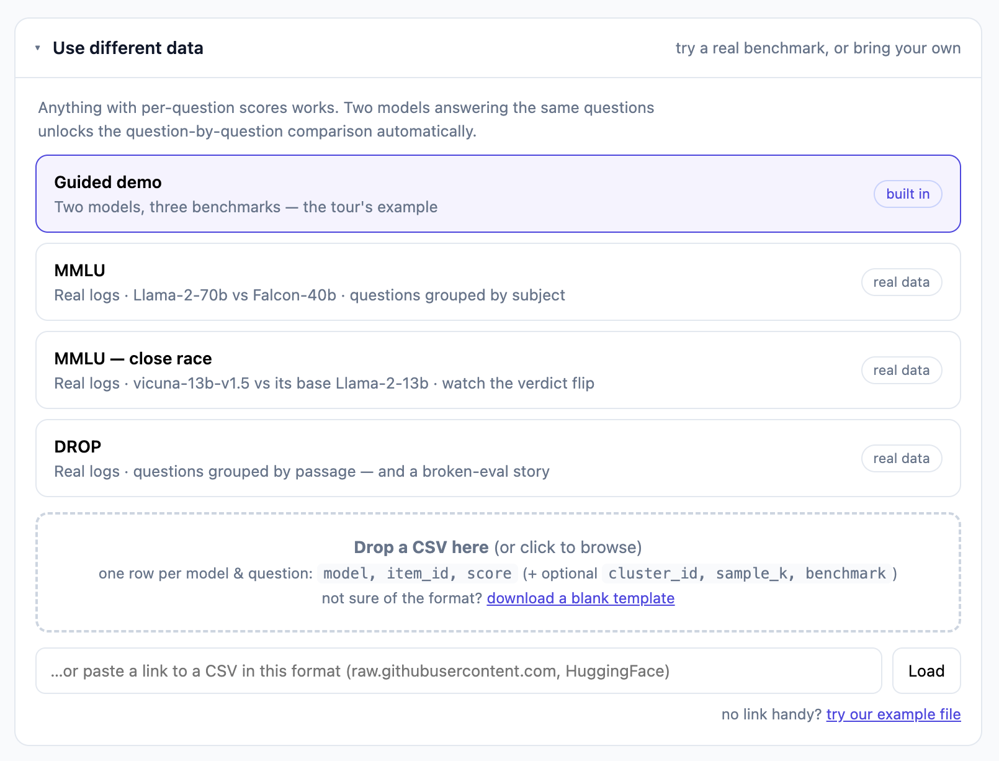
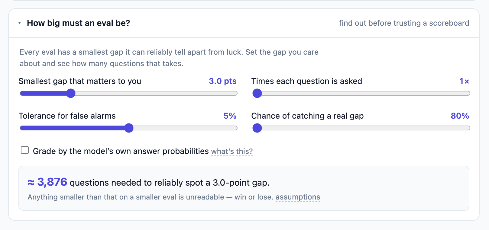

# Design rationale for "Fluke"

Live: [jv8-alt.github.io/fluke](https://jv8-alt.github.io/fluke/) · Method: Miller, [*Adding Error Bars to Evals*](https://arxiv.org/abs/2411.00640) (Anthropic, 2024) · Companion to the [README](../README.md)

## Background

For this exercise, I built a very simple app at the intersection of two suggested themes: **Exploration & Understanding** (make a hard technical idea graspable without equations) and **Evaluation & Data Quality** (the idea *is* how you trust a model comparison).

The seed of the idea, however, had already been taking shape for some time. Whenever a new model comes out, there's a benchmark table that touts the model's benchmark scores as compared to competitors -- "87.5% on math problems vs 85.2% for the previous reigning champ." How accurate are these scores? If we kept asking the models the same questions would that gap be identical each time? How much of this is marketing vs. reality? How does this all work?

That rabbit hole led me to [*Adding Error Bars to Evals*](https://arxiv.org/abs/2411.00640) -- by Evan Miller from Anthropic (2024). The paper answers these questions rigorously, but then it seemed to me that these valuable answers transitioned into an after-life as estimator algebra. Maybe it exists somewhere, but I couldn't find any experience that brought these conclusions to life in a way that accommodates a broader audience.

Much of the machinery does already exist as Python libraries (`evalci`, `evalstats`, Inspect AI's `stderr()`, Every Eval Ever). Each will hand you a number. **What none of them gives you is somewhere to navigate** — to *see* a familiar leaderboard claim fall apart under honest statistics, and to frictionlessly play with variables to better understand their impact individually and collectively. 

"Fluke" is my attempt to bridge that gap.

## Core principles

The foundations of the Fluke experience are these five directives, in plain language, that I took from the paper:

1. **Report the margin of error with every score.** A benchmark score is a poll, not a fact: the questions are a sample standing in for all possible questions of that kind.
2. **Account for clustering.** Bundled questions are less data than they look. Five questions about one passage, or one question in ten languages, rise and fall as a bloc — like polling 1,000 people from 200 households. Honest error bars can be 2–3× wider than naive ones.
3. **Reduce answer luck the legitimate ways — never by lowering temperature.** Score noise = question luck (only more questions help) + answer luck (shrink with K repeats, or eliminate by reading token probabilities). Temperature 0 (no randomness/variation) measures a different model.
4. **Compare models question-by-question, not scoreboard-to-scoreboard.** When both models answered the same questions, subtract per question first: shared difficulty cancels, leaving the real between-model signal. Same averages, meaningfully tighter bars — a free win whenever scores correlate (they nearly always do).
5. **Check the eval's eyesight before trusting it.** Every benchmark has a smallest gap it can reliably detect, set mostly by question count (~1,000 questions to see a 3-point gap). Know the threshold before you run the eval — or before you believe someone else's.

The paper is full of difficult equations that are beyond the grasp of non-statisticians like me. The app's job is to let someone *feel* those five points without reading them first — and still drill into the formula and deeper context when they want to.

## The solution

The experience of the app is centered on deconstructing and nuancing leaderboards and their benchmarks. In its most rudimentary form, it can serve as an interactive companion piece to Miller's paper.

### "Paper mode" -- bringing Miller's work to life

#### First: The leaderboard everyone believes

#### Include the margin of error, and the story starts to change

#### Apply all of the paper's core corrections, and the verdict fully flips

### Drill-in: More detail for subject matter experts or the merely adventurous

The leaderboard verdict changes tell a story on their own, but what are the mechanics and maths underpinning these changes? There is a "gaps" section that goes into a bit more detail, and the experience is filled with richly detailed pop-ups for those who want to see the actual formulas and/or connect back directly to the paper for more context.

### Validate and share

Though support is very limited for now, I wanted users to be able to evaluate data beyond the scope of the paper. I added some examples of real-world benchmarks and models that I found online, as well as an option for users to upload their own data via CSV, including via url: 

Note: The app currently requires very specific, non-standard formatting -- a deficit that I would want to prioritize for follow-up.

### Plan

This stretch goal addressed a slightly different use case -- building on the paper's foundational insights to give model tuners an experience that helps them determine what their eval would need before a gap of a certain size could be "true" and meaningful:

I debated leaving this off because it's the biggest departure from the rest of the experience, and because it moves me further out of my own comfort zone into how model tuning might actually work. In the end, I decided to keep it as a pointer to use cases and topics that I'd like to learn more about.

## Key decisions & tradeoffs

**The verdict is the interface.** Assumed leaderboard readers don't consume "SEs" or other statistical terms -- they consume "who won." So the headline object is the verdict ("real ✓" / "too close to call"), and the claim line re-derives the one-sentence takeaway on every toggle. Means stay identical; only the honesty of the reading changes.

**Plain language first, formulas on demand.** Default-visible text uses the paper's own analogies — polls, households, "could just be luck." Every dashed value opens a popover with the mechanism, the exact formula, and the paper § it implements. Experts can audit every number; nobody else ever has to see a σ.

**One pipeline for all data.** Bundled snapshots, dropped CSVs, and URL-fetched CSVs all flow through the same parser into the same stats. The demo *is* a real tool: any eval with per-question scores gets the same treatment, and any view (including an upload) is shareable as a URL.

**Fully static, no backend.** The original sketch had a small upload/storage API; we cut it for scope and honesty — the stats run client-side anyway. Sharing encodes state (and small CSVs) into the URL fragment. Tradeoff: very large uploads can't be linked; the app says so. A storage backend can still slot in behind the same load-a-dataset seam later.

**Strict CSV schema v1**, friendly row-level errors, downloadable template — not format sniffing. This made sense for a 2-hour build, but would add a lot of friction in production. This is one of the tradeoffs I'd revisit first. Fetching from the hosts we advertise works fine; what blocks people is that almost no published CSV happens to be in `model,item_id,score` form. As shipped, the URL box is a convenience for a file *you* already formatted.

**Stats as pure, zero-dependency functions** with hand-computed expected values in the tests (plus the paper's worked examples: ≈969 questions for a 3-point gap). We validated against hand arithmetic inside the build window; cross-checking against `evalci`/`statsmodels` golden fixtures is the first honest follow-up.

**Typescript only/primarily** made sense for the rich interactive experience I envisioned. But there is some friction with `evalci` and other stats utilities, as well as the scripts that the agents used to help wrangle data. It may be acceptable in the eventual production version of this app to maintain Python just in dev/test/build layers, even as we build the experience out in Typescript, but it'd be worth revisiting.

**~20 KB gzipped, Preact + Vite, hand-drawn SVG, no chart library, no LLM calls, no keys.** The constraint that kept the experience the product.

## Where to go from here?

### Make sure it's true 😅

- Do subject matter experts even agree with Miller's assessments, or with my implementation thereof? arXiv.org is for pre-print papers that have not yet been peer-reviewed. (I think I even discovered a typo between Table 1 and Table 2, 87.7% in one, 86.7% in the other, but that needs validation.) I am not enough of statistician to fully validate.
- Even if subject matter experts fully agree, are the observations stale? 2 years in this field is 2 lifetimes. Does everyone now implement Miller's suggestions? Are there new concerns? If I'd had more time I would have done a lot more validation around this.

Beyond that, I took some shortcuts to just get it basically working. My own margins of error are acceptable for this exercise, but not acceptable when you're trying to evaluate accuracy -- particularly with a tool that is trying to correct for imprecision to start with. There are really two gaps here: whether my numbers are *calculated* right, and whether they answer the *right question*.

*Are the numbers right?*

- **Check them against the established libraries.** Automated comparisons against `evalci` / `statsmodels` on shared examples — trust the numbers the way the UI asks you to trust a verdict.
- **Fix the few-groups case.** Once you count groups instead of questions, your real sample size is the *number of groups* — and when groups are few, my margins come out slightly too narrow. MMLU's 57 subjects and the example file's 40 passages each want a margin about 2–3% wider than I show, plus a known correction to the formula itself. I checked, and neither changes any verdict in the shipped data — but a tool that corrects overconfidence shouldn't carry its own.
- **Handle very high and very low scores.** The standard formula I use misbehaves near 0% and 100%. It makes no difference at 65%, and is materially wrong at 3% or 97% — which uploaded data will hit.
- **Measure answer luck from the data.** Repeat runs (`sample_k`) would show how much of the noise is the model being inconsistent, versus the questions just being a sample. Today the "how big must an eval be?" panel uses the paper's illustrative figures rather than the loaded dataset's own.

*Are we asking the right question?*

- **Three benchmarks means three chances to be wrong.** Each verdict tolerates a 1-in-20 false alarm, so across three the odds of at least one land nearer 1 in 7 — and real leaderboards have dozens. The app ignores this, which is awkward for a tool premised on "you're more certain than you should be."
- **Say what the error bars assume.** They answer: *if we drew a different random sample of questions, how much would the score move?* But MMLU wasn't drawn from a pool of possible questions — it was hand-built. If the 164 HumanEval problems are exactly what you care about, there's no sampling luck to speak of, and the bars answer a question you didn't ask. That's a judgement call, and the app states it nowhere.
- **Put real models in the tour.** Paper mode is synthetic — constructed to reproduce the paper's published summary numbers. That makes it an honest demonstration, but not evidence. Swap in a real comparison as soon as per-question data for one is publishable.

**Make it more useful** 

- Unlock true leaderboard mode: There are so many models and benchmarks out there, so much data to make use of. We should be able to replicate common leaderboards across many more models and benchmarks at once. Change the variables and see how verdicts do or do not change.
- Treat harness reality as the dataset API. The burden today isn't "rename a header" — it's "concatenate two exports and synthesize a `model` column." **Multi-file merge** (drop two per-model logs, join on item id, take names from filenames) is the endpoint that actually makes "bring your own eval" a reality.
- Accounts and persistence: Users should be able to upload and play with their own data over time. The front-end only implementation we currently have, with the extremely limited sharing, amounts to toy-mode. We'd need an API, persistence layer, and a lot more to turn this toy into a tool.
- UI/UX: The flow is a bit awkward -- selecting your dataset below and having it apply to experiences above. Without referencing that selection interface below it can be difficult to orient to what you're looking at. We should reflow it so that data selection is left/top and the experiences below flow from it.
- Polish: We have very little in the way of error handling. In-experience messaging is inconsistent and sometimes unintuitive. Much we can do here!

## Time

- Planning: ~1 hour (including time spent outside Claude)
- Building: ~2 hours
- Tweaking/Fixing: ~1 hour
- Demo and documentation: TBD
